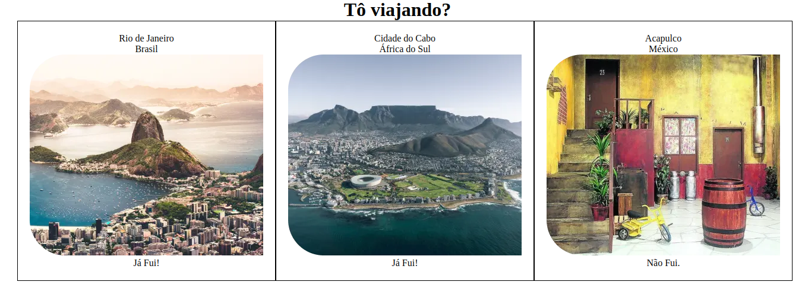

# README: Tô viajando



## Project Description

This is my first frontend project using React. It's a simple card list that renders information about places. Below each of them, I wrote whether I have ever been there or not.

### Technologies

- LINUX
- VSCODE
- TYPESCRIPT
- VITE
- REACT


### What I Learned

- How to import and export components in react
- How to use props to send data for other components

## How to Run the Project

1. Clone the repository:

   ```bash
   git clone https://github.com/feduarte-dev/to-viajando
   ```

2. Navigate to the project directory:

   ```bash
   cd your-repository
   ```

3. Install dependencies:

   ```bash
   npm install
   ```

4. Run the application:

   ```bash
   npm run dev
   ```

## Contributions

[Felipe](https://www.linkedin.com/in/feduarte-dev/) -  /components - app.tsx


[Trybe](https://www.betrybe.com/) - Everything else
